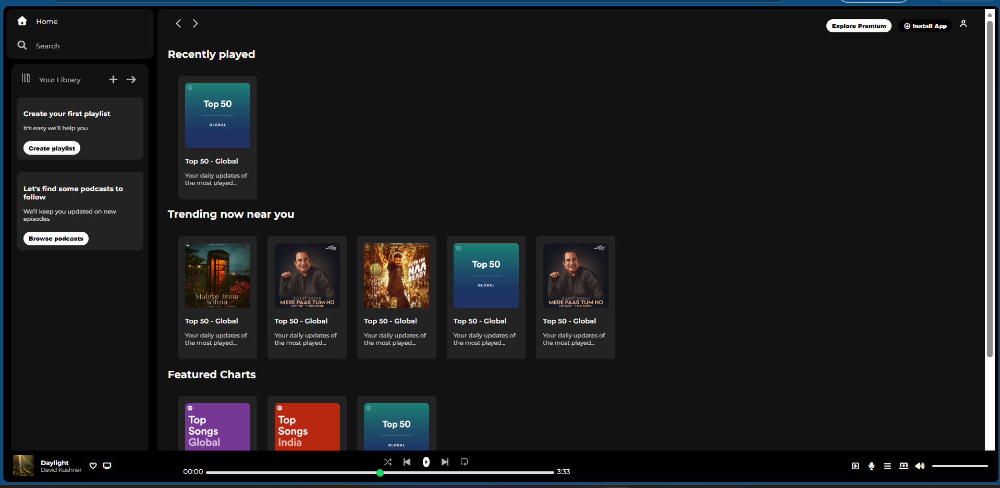

🎵 Spotify Clone

A responsive Spotify Clone built using HTML and CSS. This project recreates the basic layout and design of Spotify's web player, focusing on UI design and responsive web development.

🚀 Features

- 🎧 Modern Spotify-inspired user interface
- 📱 Responsive design for different screen sizes
- 🎵 Sidebar navigation
- 📂 Playlist section
- ▶️ Music player footer
- 🎨 Clean and attractive layout using CSS
- 💻 Beginner-friendly project

🛠️ Technologies Used

- HTML5
- CSS3

📁 Project Structure

Spotify-Clone/
│── index.html
│── style.css
│── assets/
│   ├── images/
│   ├── icons/
│   └── songs/
└── README.md

## 📸 Preview

▶️ How to Run

1. Download or clone the repository.
2. Open the project folder.
3. Double-click "index.html" or open it using Live Server in VS Code.

🎯 Learning Objectives

This project helped me learn:

- HTML page structure
- CSS Flexbox
- Responsive Design
- Positioning and Layout
- UI Cloning
- Git & GitHub basics

📌 Future Improvements

- Add JavaScript functionality
- Play/Pause music
- Progress bar
- Volume control
- Dark/Light mode
- Mobile menu

👩‍💻 Author

Shruti Maheshwari

If you like this project, feel free to ⭐ the repository!